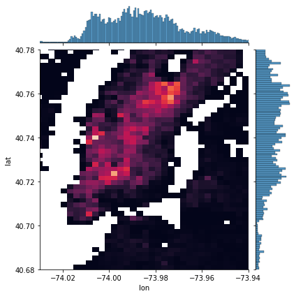

# UBER Pickups Project
Project on Unsupervised Machine Learning - KMeans and DBScan

  

[Video presentation](https://share.vidyard.com/watch/GZq7BETXYyC3P5gZbrUWnP?)  

## Table of contents
* [Project](#project)
* [Pipeline](#pipeline)
* [Deliverables](#deliverables)
* [Model Performances](#modelperformances)
* [Technologies](#technologies)
* [Getting Started](#getting-started)
* [License](#license)
* [Author](#author)

## Project  

Uber is one of the most famous a ride-sharing application in the world. One of the main pain point that Uber's team found is that sometimes drivers are not around when users need them. For example, a user might be in Meat Packing District whereas Uber drivers are looking for customers in Upper West Side. 

Eventhough both neighborhood are not that far away, users would still have to wait 10 to 15 minutes before being picked-up, which is too long. Uber's research shows that users accept to wait 5-7 minutes, otherwise they would cancel their ride.

Therefore, Uber's data team would like to work on a project where their app would recommend hot-zones in major cities to be in at any given time of day.

Tasks:

Uber already has data about pickups in major cities. The objective is to create algorithms that will determine where are the hot-zones that drivers should be in. Therefore you will:

*  Create an algorithm to find hot zones

*  Visualize results on a nice dashboard

## Pipeline  


## Deliverables  
Deliverables available:

1- Interactive maps with hot-zones using any python library (plotly),

2- Hot-zones per day of week and per shift time

3- Results obtained with two unsupervised algorithms KMeans and DBScan.

## Model Performances  

**Fig 1**- Density of Uber pickups in Manhattan island  
  

**Fig 2**- Number of Uber rides per shift with K-Means   
  

**Fig 3**- Number of Uber rides per shift with DBScan  
  

## Technologies  

Project is created with:
* Python 3.8
* Jupyter Notebook 6.4.12
* Python libraries (see /requirements.txt)
* VSCode 1.71.2

or this github project can be launched on [colab-google](https://colab.research.google.com) without any local installations. It is free and requires Google account sign-in.  

## Getting Started

To run this project, 
1. Clone the repo:
   ```sh
   git clone https://github.com/levist7/UBER_Pickups_Project.git
   ```
2. Install [packages](#technologies)

3. Install python libraries
   ```sh
   pip3 install -r requirements.txt
   ```

## License

Distributed under the MIT License. See LICENSE.txt for more information.

## Author  

* [levist7](https://github.com/levist7)  
---
Made with ❤️ in Paris
---
